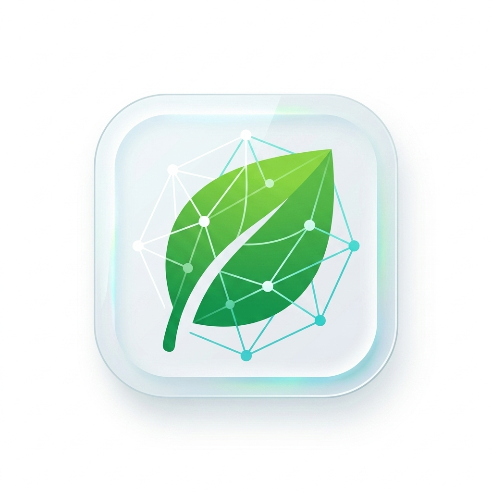

  
  <h1>Nourish - Intelligent Dietary System</h1>
  
<strong>A Next-Generation Dietary Planning & Optimization Engine</strong>

---

## 💡 The Ideology
Nourish was conceptualized with a core philosophy: **Dietary tracking shouldn't be a mathematical chore.** We believe that an Intelligent Dietary System should not merely count calories—it should actively assist in holistic wellness by learning user patterns, automatically suggesting healthy substitutions, and dynamically optimizing macronutrients based on real-world constraints.

We are shifting the paradigm from *passive tracking* to *active, intelligent optimization*.

## 🛠️ Tech Stack
This project was engineered over **4.5 months** of rigorous development, utilizing a modern, highly scalable mobile architecture.

  
  
  
  

## 📅 Development Timeline (4.5 Months)
- **Month 1:** Architectural design, database schema planning (Supabase), and foundational React Native/Expo setup.
- **Month 2:** Core tracking features, UI/UX implementation, and robust offline-capable state management.
- **Month 3:** Development of the Substitution Engine and integration of macro/micro-nutrient optimization algorithms.
- **Month 4:** Integration of advanced ML models, rigorous performance profiling, and bug squashing.
- **Final 2 Weeks:** QA testing, New Architecture (Fabric) migration, and production deployment preparation.

## 🚀 Distinguishing Factors
Unlike traditional diet-tracking applications, Nourish stands out through its deeply integrated intelligent features:
- **Algorithmic Substitutions:** The Substitution Engine dynamically replaces unhealthy food items with nutritionally superior alternatives while matching the user's taste profile.
- **Automated Dietary Optimization:** Leverages intelligent algorithms to adjust portion sizes and suggest meals that precisely meet daily micro and macronutrient goals (RDA compliance).
- **Zero-Friction Logging:** A seamless, predictive logging system that learns from user habits and auto-completes meals based on historical data and time of day.
- **Robust Tech Stack:** Built with a highly scalable, modern React Native (Expo) architecture featuring the New Architecture (Fabric) for ultra-fast native UI rendering.

## 🌟 Core Benefits
- **For Users:** A frictionless, personalized health companion that takes the mental load out of meal planning and macronutrient balancing.
- **For Developers/Reviewers:** A clean, modular, and highly typed (TypeScript) codebase demonstrating state-of-the-art mobile development practices, robust state management, and complex algorithmic integrations on the client side.

## ⚠️ Current Limitations & Future Scope
- **Offline Mode:** While caching is implemented, robust offline-first synchronization with the backend is still under development.
- **Dataset Scale:** The current food catalog is highly curated but will require expansion to encompass a global variety of regional cuisines.
- **AI Personalization:** Currently integrating advanced machine learning for even more nuanced, context-aware dietary recommendations based on real-time biometric feedback.

---

### 📥 Download the App
You can download and test the compiled production APK directly from the **Releases** section of this repository. 
*(See the right sidebar ➡️ or click on "Releases" to download the `.apk` file to your Android device).*
